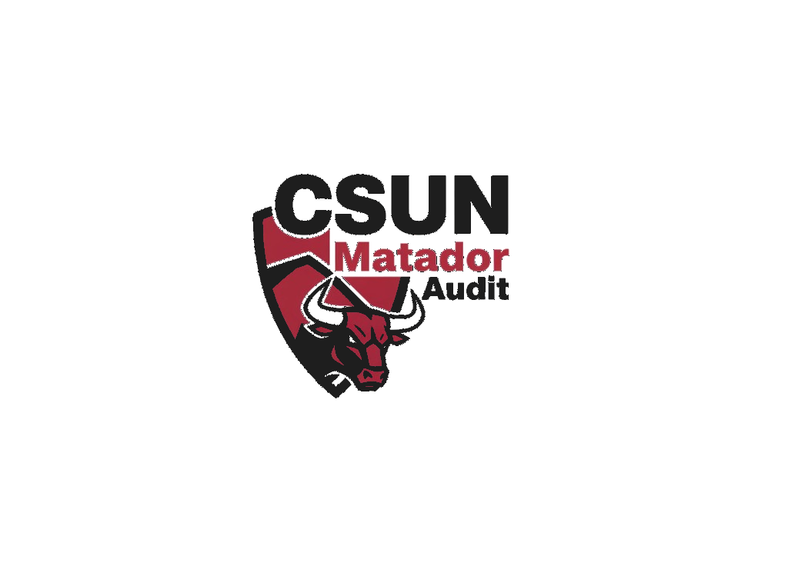

<p align="center">
  
</p>

<h1 align="center">MatadorAudit</h1>

<p align="center"><strong>AI-Powered Fairness Auditing for University Systems</strong></p>

<p align="center">CSUN AI Jam 2026 | Ido Cohen & Zach Bar</p>

---

MatadorAudit lets non-technical university administrators audit AI-driven systems for demographic fairness. Upload a dataset, get instant disparity detection, plain-English reports, and an interactive What-If Simulator.

## Why

CSUN is a Hispanic-Serving Institution -- 56.2% Hispanic/Latino, 58% Pell-eligible, 47% first-generation. AI tools used in admissions, financial aid, course recommendations, and plagiarism detection must serve all students equitably. MatadorAudit makes that verifiable.

## Live Sites

- **Landing Page & Chatbot:** [matadoraudit.netlify.app](https://matadoraudit.netlify.app) -- interactive dashboard with embedded AI chatbot widget
- **Full Tool:** [matadoraudit.streamlit.app](https://matadoraudit.streamlit.app) -- complete fairness auditing platform
- **GitHub:** [github.com/IdoCohen560/MatadorAudit](https://github.com/IdoCohen560/MatadorAudit)

## Features

- **Upload & Analyze** -- 3 demo datasets (Standard, High Bias, Fair) + custom CSV upload
- **Multi-Audit Dashboard** -- 8 audit scenarios (financial aid, STEM recommendations, plagiarism detection, admissions screening, at-risk flagging, scholarship allocation, academic advising, gender parity), 3 view modes (Summary Cards, Detailed Charts, Comparison Table)
- **Fairness Report Card** -- native Streamlit components, expandable metric explanations with citations, risk levels, 6-step action plan
- **Proxy Discrimination Detection** -- correlation analysis with actionable next steps
- **What-If Simulator** -- threshold adjustment with before/after comparison
- **AI Q&A Assistant** -- OpenRouter (free, built-in key), Claude, ChatGPT, Gemini, Copilot. Clickable suggested questions + free-form input
- **Export Report** -- PDF + CSV download

## Quick Start

```bash
pip install -r requirements.txt
streamlit run src/app.py
```

## Tech Stack

| Component | Role |
|-----------|------|
| Python + Streamlit | Dashboard |
| Own Python Fairness Engine | Fairness metrics (no scipy, no Fairlearn, no AIF360) |
| OpenRouter (free) | Default AI Q&A (Nvidia Nemotron, GPT-OSS, Gemma, Liquid) |
| Anthropic Claude API | Optional AI report generation (user provides key) |
| ChatGPT / Gemini / Copilot | Alternative AI Q&A providers |
| Plotly | Visualizations |

## Project Structure

```
MatadorAudit/
├── src/
│   ├── app.py                 # Streamlit dashboard
│   ├── fairness_engine.py     # Core fairness metrics
│   └── report_generator.py    # Claude API reports
├── data/
│   └── csun_synthetic_students.csv
├── docs/
│   ├── proposal/              # Competition proposal
│   └── visuals/               # Slide deck
├── scripts/
│   └── generate_synthetic_data.py
└── requirements.txt
```

## License

MIT
